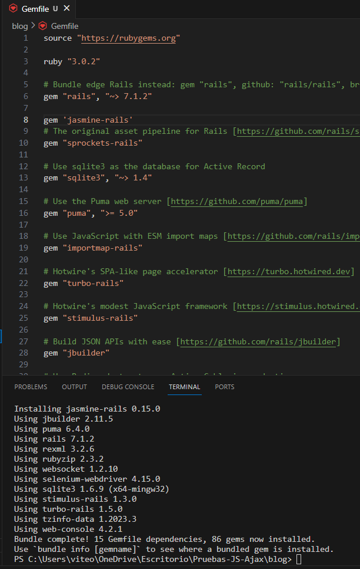
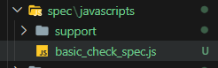
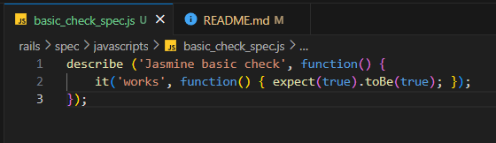

# Pruebas-JS-Ajax

1. Instalamos jasmine añadiendo la gema en nuestro gemfile y ejecutando `bundle install`

```shell
gem 'jasmine-rails
```



2. Creamos el fichero spec/javascripts/basic_check_spec.js



3. Agregamos el siguiente código


***
## Pregunta

¿Cuáles son los problemas que se tiene cuando se debe probar Ajax?. Explica tu respuesta.

## Respuesta

- Pruebas de estado

Las pruebas de Ajax deben tener en cuenta el estado actual de la aplicación, ya que esto puede afectar los resultados de las solicitudes. Por ejemplo, si una solicitud Ajax depende del valor de una variable, la prueba debe asegurarse de que la variable tenga el valor correcto antes de realizar la solicitud.

- Pruebas de errores

Las pruebas de Ajax deben tener en cuenta los errores que pueden ocurrir durante las solicitudes. En el caso que una solicitud Ajax falle, la prueba debe asegurarse de que la aplicación maneje el error correctamente.

- Pruebas de rendimiento

Las pruebas de Ajax deben tener en cuenta el rendimiento de las solicitudes. Es decir la prueba puede medir el tiempo que tarda una solicitud en completarse o el número de solicitudes que pueden realizarse por segundo.
***
## Pregunta

¿Qué son los stubs, espias y fixture en Jasmine para realizar pruebas de Ajax?

## Respuesta

- Stubs

Los stubs son objetos que reemplazan a funciones o objetos reales durante las pruebas. Por ejemplo, si desea probar una función que realiza una solicitud Ajax, puede crear un stub para la función fetch(). El stub puede devolver un objeto de respuesta simulado con los datos que desea probar.

- Espias

Las espias son objetos que registran las llamadas realizadas a una función o objeto durante las pruebas. Si desea probar una función que realiza una solicitud Ajax, puede crear una espía para la función fetch(). La espía puede registrar el URL de la solicitud, los parámetros de la solicitud y el objeto de respuesta.

- Fixture

Los fixtures son objetos que se utilizan para proporcionar datos de prueba a las pruebas. Puede crear un fixture con los datos que desea probar. Por ejemplo, puede crear un fixture con un objeto JSON que contiene los datos que se devolverán de una solicitud Ajax.

***
## Pregunta

¿Que hacen las siguientes líneas del código anterior?. ¿Cuál es el papel de spyOn de Jasmine y los stubs en el código dado.

```Ruby
it('calls correct URL', function() {
      spyOn($, 'ajax');
      $('#movies a').trigger('click');
      expect($.ajax.calls.mostRecent().args[0]['url']).toEqual('/movies/1');
    });
```

## Respuesta
Las siguientes líneas de código de Jasmine sirven para probar que un componente de JavaScript llama a la URL correcta al hacer clic en un enlace.

La primera linea `spyOn($, 'ajax');` crea un espía para el método `ajax` del objeto. Esto permite a Jasmine monitorear las llamadas al métodoajax` durante la ejecución de la prueba.

El papel del espía de Jasmine en este código es permitir a Jasmine monitorear la llamada al método ajax. Esto permite a la prueba verificar que la llamada se realiza y que la URL que se llama es la esperada.

***

## Pregunta

¿Que hacen las siguientes líneas del código anterior?.

```Ruby
 let htmlResponse = readFixtures('movie_info.html');
        spyOn($, 'ajax').and.callFake(function(ajaxArgs) { 
          ajaxArgs.success(htmlResponse, '200');
        });
        $('#movies a').trigger('click');
      });
      it('makes #movieInfo visible', function() {
        expect($('#movieInfo')).toBeVisible();
      });
      it('places movie title in #movieInfo', function() {
        expect($('#movieInfo').text()).toContain('Casablanca');

```

## Respuesta

Estas líneas de código configuran y ejecutan pruebas para verificar si la aplicación muestra correctamente la información de la película después de realizar una llamada Ajax. La prueba simula la llamada Ajax y proporciona una respuesta simulada, luego verifica si se muestra el elemento correcto con el contenido esperado.

***

## Pregunta

Indica cuales son los stubs y fixtures disponibles en Jasmine y Jasmine-jQuery.

## Respuesta

En Jasmine, los stubs se pueden crear utilizando el método spyOn(). El método spyOn() crea un espía para una función, objeto o variable real. El espía se puede utilizar para monitorear las llamadas a la función o los accesos al objeto o variable. También se puede utilizar para proporcionar una implementación falsa para la función o el objeto.

En Jasmine, los fixtures se pueden cargar utilizando la función readFixtures(). La función readFixtures() devuelve un objeto con los datos del archivo de fixture.En Jasmine-jQuery, los fixtures se pueden cargar utilizando la función loadFixtures(). La función loadFixtures() carga los datos de todos los archivos de fixture en el directorio especificado

***